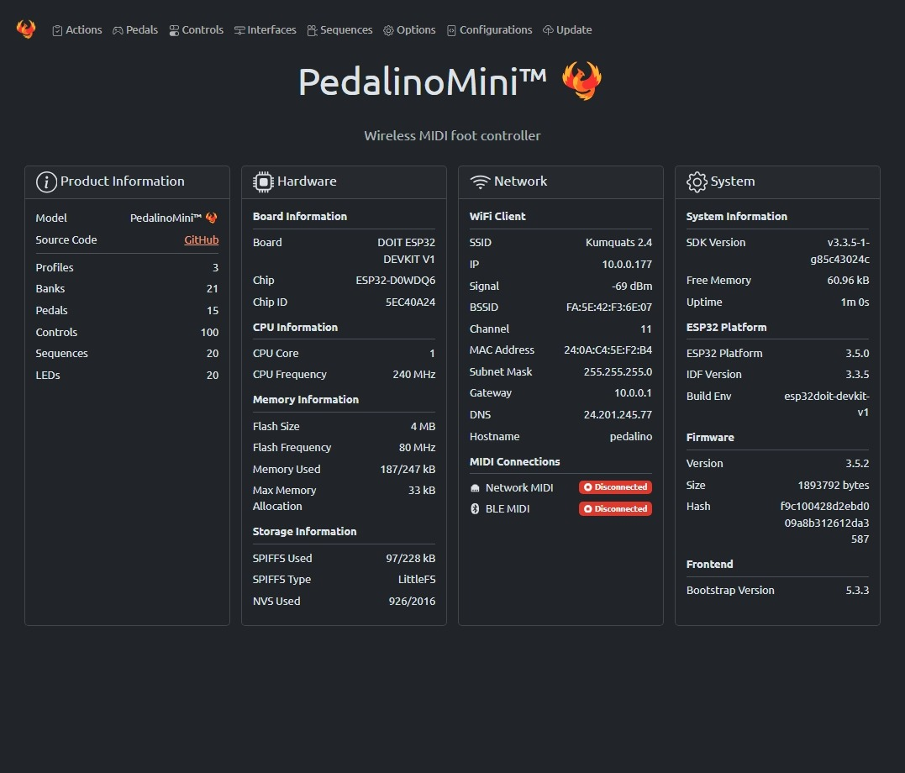
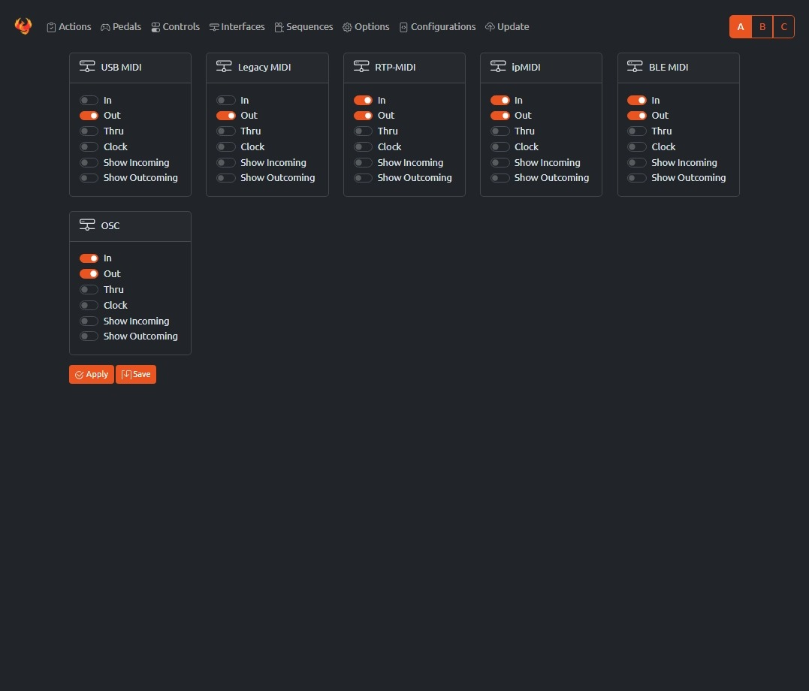

[](https://github.com/fuegovic/PedalinoMini)


# PedalinoMini™ 🐦‍🔥

This is a full-featured MIDI controller that supports up to 15 analog and digital pedals (with capacity for up to 45 foot switches total), featuring 3 user profiles with 20 banks each for extensive control configurations.

## Key Features

### Connectivity and Protocols
- **Plug-and-Play**: Works with MIDI-compatible apps and devices via:
  - Bluetooth LE MIDI 4.0 (server or client mode)
  - IEEE 802.11 b/g/n Wi-Fi 2.4 GHz with WPA/WPA2 security
  - Network MIDI (AppleMIDI/RTP-MIDI) and ipMIDI via WiFi
  - USB MIDI interface
  - Legacy DIN MIDI IN/OUT connectors

### Hardware Support
- 15 controller ports for ESP32 supporting:
  - Digital foot switches (momentary or latch)
  - Analog expression pedals and triggers
  - Up to 45 foot switches total (using resistor ladders)
  - RGB NeoPixel/WS2812B status LEDs with effects (Fire Ocean, Pacifica, Pride)

### MIDI Implementation
- Comprehensive routing between all interfaces
- Clock master and slave capabilities
- MIDI Time Code (MTC) master and slave
- Send almost any MIDI message: Program Change, Control Code, Note On/Off, Channel Pressure, Pitch Bend, Bank Select, Start, Stop, Continue or sequences

### Configuration
- 3 user profiles with automatic profile LED indicator
- 20 banks + 1 global bank per profile
- 20 sequences of 10 steps each
- Responsive mobile-first web interface (http://pedalino.local)
- Over-the-Air (OTA) firmware updates
- Browser-based firmware installation and WiFi provisioning

## Table of Contents

- [Key Features](#key-features)
  - [Connectivity and Protocols](#connectivity-and-protocols)
  - [Hardware Support](#hardware-support)
  - [MIDI Implementation](#midi-implementation)
  - [Configuration](#configuration)
- [Bill of materials](#bill-of-materials)
- [Schematic](#schematic)
  - [Warnings](#warnings)
- [USB MIDI using Arduino Pro Micro](#usb-midi-using-arduino-pro-micro)
- [How to upload firmware, WiFi provisioning and access to web user interface](#how-to-upload-firmware-wifi-provisioning-and-access-to-web-user-interface)
- [How to Build and Upload PedalinoMini™](#how-to-build-and-upload-pedalinomini)
  - [Prerequisites](#prerequisites)
  - [Getting the Code](#getting-the-code)
  - [Building and Uploading](#building-and-uploading)
- [How to connect PedalinoMini™ to a WiFi network](#how-to-connect-pedalinomini-to-a-wifi-network)
- [Boot modes](#boot-modes)
- [How to connect to the web user interface](#how-to-connect-to-the-web-user-intertface)
- [Pedals](#pedals)
- [Controls](#controls)
- [Actions](#actions)
- [Display mode](#display-mode)
- [Interfaces](#interfaces)
- [Sequences](#sequences)
- [Options](#options)
- [Configurations](#configurations)
- [Update](#update)
- [How to switch profiles](#how-to-switch-profiles)


## Bill of materials

- Any ESP32 board supported by [Arduino core for ESP32](https://github.com/espressif/arduino-esp32)
  - Tested on [DOIT ESP32 DevKit V1](https://github.com/SmartArduino/SZDOITWiKi/wiki/ESP8266---ESP32) 4M dual-mode Wi-Fi and Bluetooth module
- OLED I2C 0.96"/1.3" display 128x64 pixels SSD1306/SH1106 based

- USB MIDI and DIN MIDI connection requires additional hardware.

## Schematic


### Warnings

- Do not forget the add the pullup resistors on PIN_A1 to PIN_A6 otherwise pins will be floating. A floating pin can trigger unexpected MIDI events. As alternative you can disable the not used pedals via web interface.

To create your own ladder you can start simulating the below one:

- [Circuit Simulation Applet](https://www.falstad.com/circuit/circuitjs.html?ctz=CQAgjCAMB0l3BWKIBsAOESGUwUwLRhgBQATuAJwBMIAzDVQOw33JVVxkhMsvp00cAFkadytfqyEohA5GHiQu02awQocrHO3hd1mminVzhozgGdKvK+A3yQAF1IBXXMUs85nsHZwQnru50knwYPjh+ji5ulipyceH2ATGYdmp2iZHJQUYocrm2EeBRgeRE1mDUJuC6API2iUJhGVDEAO4Ndt6+7dzMhcHNEb0SQyAJPR0TOPoDSh2ziQWZxADmNlRCflW0kLLDAErgYBUntsjCmtC0F1DQCMQAHuCM4EI3jK9g0uPcsgcASQAcgBxJ7cFhEY5IWjfX6bEAAZQAMgBRVEANVR4IgtFkaFetFesgRABUAQAFAA65loGNoXEqDC2nSKCl0z0qFHA2G4KBuYAQN1kPhAgATCGAIDGAJMJwUxud9uRIIIKaCK8hLoLkZeCiSKhNyhMZVb9RZqUCgwDrnuovk1UAaeRB1eKYPQrbLniI-I6EAgaCaXZr-VRreNdiBCOMqmq-uBoGA0Bjwf68lGEGgMLGETALcnnigEVH0Hls-trkJ8+A0BAo1QFNx4aoq1QELXcXBGySSfcq7RaEgo7QKK8y-G0JXiEA)

## USB MIDI using Arduino Pro Micro

The cheapest and compact way to implement an USB MIDI connection is using an Arduino Pro Micro and the [BlokasLabs/USBMIDI](https://github.com/BlokasLabs/USBMIDI) library. Upload the [UsbMidiConverter](https://github.com/BlokasLabs/USBMIDI/blob/master/examples/UsbMidiConverter/UsbMidiConverter.ino) example into the Arduino Pro Micro.

Serial1 of ESP32 (re-mapped to pin 18 RX and 19 TX) is connected to Serial1 (pin 1 TX0 and pin 2 RX1) of Arduino Pro Micro. Use a 3.3V Pro Micro board. A 5V Pro Micro board works too because the ESP32 is usually 5V tolerant.

Arduino Pro Micro is powered by the USB MIDI connection.

IMPORTANT: ESP32 board and Arduino Pro Micro must share GND.

## How to upload firmware, WiFi provisioning and access to web user interface

TBD

## How to Build and Upload PedalinoMini™

### Prerequisites

1. **Install [Visual Studio Code](https://code.visualstudio.com/)**

2. **Install [PlatformIO Extension for VSCode](https://platformio.org/install/ide?install=vscode)**
   - Open VSCode
   - Go to Extensions (Ctrl+Shift+X)
   - Search for "PlatformIO" and install it
   - Restart VSCode when prompted

3. **Install Git**
   - **Windows**: Download and install from [git-scm.com/download/win](https://git-scm.com/download/win)
   - **macOS**: Run `xcode-select --install` in Terminal
   - **Linux**: Use your package manager (e.g., `sudo apt install git`)

### Getting the Code

**Option 1: Command Line (Recommended)**
```bash
git clone https://github.com/fuegovic/PedalinoMini
cd PedalinoMini
code .
```

**Option 2: Using VSCode's Git Interface**
1. Open VSCode
2. Press `Ctrl+Shift+P` (or `Cmd+Shift+P` on macOS)
3. Type "Git: Clone" and select it
4. Enter the repository URL: `https://github.com/fuegovic/PedalinoMini`
5. Select a directory where you want to store the project
6. Click "Open" when prompted

### Building and Uploading

1. **Open the PlatformIO sidebar**
- Click the PlatformIO icon in the left sidebar (looks like an ant)

2. **Select your environment**
- Expand "PROJECT TASKS"
- Find your board (e.g., `env:esp32doit-devkit-v1`)

3. **Build the firmware**
- Under your selected environment, expand "General"
- Click "Build"
- Wait for the build to complete

  **Alternative methods if you can't find this option:**
  - In the PlatformIO menu at the bottom of VSCode, click "PlatformIO: Build"

4. **Upload the firmware**
- Under "General", click "Upload"
- Wait for the upload to complete

  **Alternative methods if you can't find this option:**
   - In the PlatformIO menu at the bottom of VSCode, click "PlatformIO: Upload"

5. **Upload the File System Image** (crucial for WebUI functionality)
- Under your selected environment, expand "Platform"
- Click "Upload File System Image"

  **Alternative methods if you can't find this option:**
   - In the PlatformIO menu at the bottom of VSCode, click "PlatformIO: Upload File System Image"
   - Or use the command line in the project directory:
     ```bash
     pio run -t uploadfs
     ```

#### Troubleshooting

- If you can't find the "Upload File System Image" option, make sure your selected environment supports it
- If using the command line for uploadfs, ensure you've installed the PlatformIO CLI tool
- Check the PlatformIO documentation for your specific board if you encounter issues

#### Important Note

> Don't skip the "Upload File System Image" step, as the WebUI will not function properly without it.

> Before any update save configuration, reset to factory default and reload configuration. EEPROM can change without any further advice.

## How to connect PedalinoMini™ to a WiFi network

PedalinoMini™ supports IEEE 802.11 b/g/n WiFi with WPA/WPA2 authentication (only 2.4 GHz).

PedalinoMini™ support 5 WiFi provisioning methods: 1 via USB, 1 via Bluetooth and 3 via WiFi.

PedalinoMini™ is using [ESP Web Tools](https://esphome.github.io/esp-web-tools/) not only to install the firmware, via USB with a click of button right from you browser, but also to connect it to WiFi with the same simplicity via USB or Bluetooth.

PedalinoMini™ also implements Wi-Fi Protected Setup (WPS) and Smart Config technology ([Espressif’s ESP-TOUCH protocol](https://www.espressif.com/en/products/software/esp-touch/overview)). WPS needs access to the WPS button on the WiFi router. Smart Config requires a smartphone with one the following apps:

- [ESP8266 SmartConfig](https://play.google.com/store/apps/details?id=com.cmmakerclub.iot.esptouch) for Android
- [Espressif Esptouch](https://itunes.apple.com/us/app/espressif-esptouch/id1071176700?mt=8) for iOS

If the WiFi network is not available PedalinoMini™ will create an hotspot for you. Once connected to the PedalinoMini™ hotspot, you can use the web interface to set the SSID and password of an access point that you would like to connect to.

- On power on PedalinoMini™ will try to connect to the last know access point
- If it cannot connect to the last used access point within 15 seconds it enters into WiFi provisioning mode via USB or Bluetooth
- Visit http://alf45tar.github.io/PedalinoMini/installer and follow the instructions
- If provisioning is not finished within 60 seconds it enters into Smart Config mode (if compiled with -D SMARTCONFIG in platformio.ini)
- Start one of the suggested apps to configure SSID and password
- If it doesn't receive any SSID and password during the next 60 seconds it enters into WPS mode (if compiled with -D WPS in platformio.ini)
- Press or press and hold (it depends by your router) the WPS button on your WiFi router __after__ PedalinoMini™ entered in WPS mode
- If it doesn't receive any SSID and password during the next 60 seconds it switch to AP mode
- In AP mode PedalinoMini™ create a WiFi network called 'Pedalino-XXXXXXXX' waiting connection from clients. The required password is XXXXXXXX (uppercase). XXXXXXXX is a variable string.
- Reboot PedalinoMini™ to restart the procedure.

Any of the previous steps can be skipped pressing BOOT button.

```C++
void wifi_connect()
{
  auto_reconnect();           // WIFI_CONNECT_TIMEOUT seconds to reconnect to last used access point
  if (!WiFi.isConnected())
    improv_config();          // IMPROV_CONFIG_TIMEOUT seconds to receive provisioning SSID and password via USB or Bluetooth and connect to WiFi
  if (!WiFi.isConnected())
    smart_config();           // SMART_CONFIG_TIMEOUT seconds to receive SmartConfig parameters and connect
  if (!WiFi.isConnected())
    wps_config();             // WPS_TIMEOUT seconds to receive WPS parameters and connect
  if (!WiFi.isConnected())
    ap_mode_start();          // switch to AP mode until next reboot
}
```

## Boot modes

PedalinoMini™ has 8 boot modes:

Mode|Name|Description
----|----|-----------
1|Normal|BLE and WiFi are enabled. PedalinoMini™ starts the WiFi procedure on boot (connect to last AP -> WiFi Provisioning -> SmartConfig -> WPS -> Access Point).<br>After boot PedalinoMini™ will wait for BLE-MIDI connection.
2|Bluetooth Only|WiFi and Web UI are disabled.<br>PedalinoMini™ will wait for BLE-MIDI connection only.
3|WiFi Only|PedalinoMini™ starts the WiFi procedure on boot (connect to last AP -> WiFi Provisioning -> SmartConfig -> WPS -> Access Point).<br>BLE is disabled.
4|Access Point with Bluetooth|PedalinoMini™ skip the WiFi procedure on boot and create a WiFi Access Point.<br>PedalinoMini™ will wait for BLE-MIDI connection too.
5|Access Point without Bluetooth|PedalinoMini™ skips the WiFi procedure on boot and create a WiFi Access Point.<br>BLE is disabled.
6|Reset WiFi credentials|Forget the last connected access point.<br>On next boot PedalinoMini™ can be connected to a new AP.
7|Ladder Config|Learn mode for your ladder pedal. Any resistors ladder (up to 6 buttons) can be calibrated just pressing footswitches in any sequence. During calibration press and hold the footswitch until the timeout expires (the upper bar reaches zero) and the measure is acquired with a value in the botton bar. After calibration footswitches are numbered depending of the corresponding analog value: lower value lower number.
8|Factory Default|Reset EEPROM to factory default.

The last booting mode (1-5) is selected if you don't press any button on boot.

The default boot mode is (1) Normal.

To select a different mode:

- Press and release EN button (POWER button on TTGO T-Eight) and immediately after press and hold BOOT button (CENTER button on TTGO T-Eight)
- Follow the instructions on display. Keep it pressed until the progress bar reach the end to reset to factory default. If you release the button before the progress bar reach the end PedalinoMini™ will start in one of the supported boot mode.

Mode|Name|USB-MIDI|Legacy MIDI|RTP-MIDI|ipMIDI|BLE MIDI|OSC|Web UI|OTA Firmware Update|HTTP Firmware Update
:--:|----|:------:|:---------:|:------:|:----:|:------:|:-:|:----:|:-----------------:|:------------------:
1|Normal|x|x|x|x|x|x|x|x|x
2|Bluetooth Only|x|x|-|-|x|-|-|x|-
3|WiFi Only|x|x|x|x|-|x|x|x|x
4|Access Point with Bluetooth|x|x|x|x|x|x|x|x|x
5|Access Point without Bluetooth|x|x|x|x|-|x|x|x|x

- (x) Supported
  (-) Not supported
- USB-MIDI and DIN-MIDI are always available if hardware implemented.

## How to connect to the web user intertace

The responsive and mobile-first configuration web user interface is available on `http://pedalino.local` address (the address is case insensitive). The device identification name set to `pedalino` but should be is unique per device. Every device/board connected to the same network need to have a different device name.



In order to know your device name and/or the IP address press for at least half a second the BOOT button and check the display.

As alternative method you can use the IP address. If you are using the AP mode the IP address is always `192.168.4.1` and the connection address is `http://192.168.4.1` for everyone.

There is no credentials to connect to web user interface. Device name and credentials to connect to web user interface can be changed in the Options page.

## Pedals

Once PedalinoMini™ is connected to a WiFI network and you are connected to the web user interface it is time to configure which pedal is connected to each of the 15 available ports. Pedal 15 is the on board buttons and is fully configurable.


| | Description |
|:-----------|:----------- |
| Mode | Select one of the following: NONE, MOMENTARY, LATCH, ANALOG, LADDER, TRIGGER. |
| Invert Polarity | Normally open (NO) and normally closed (NC) momentary switches are supported and configurable by software if the foot switch do not have a polarity switch. On analog pedal or ultrasonic ranging sensor it invert the range. |
| Singles Press | Select Enable/Disable here to enable/disable PRESS, RELEASE and CLICK events.<br>CLICK event is detected after a PRESS followed by a RELEASE event on momentary switches and on PRESS and on RELEASE on latch switches. |
| Double Press | Select Enable/Disable here to enable/disable DOUBLE CLICK events.<br>If double press is enabled CLICK event is postponed until double press timeout (by default 400ms). |
| Long Press | Select Enable/Disable here to enable/disable LONG PRESS, REPEAT PRESSED and LONG RELEASE events.<br>LONG PRESS event is detected after a PRESS event with no RELEASE event within the long press timeout (by default 500ms).<br>After a LONG PRESS event a REPEAT PRESSED event is triggered every repeat press timeout (by default 1000ms) until the button is keep pressed.<br>After a LONG PRESS event the RELEASE event is replaced by a LONG RELEASE event.<br>Two sequences of events are possible: PRESS and RELEASE or PRESS, LONG PRESS, REPEAT PRESS (optional) and LONG RELEASE. |
| Analog Calibration | Enable analog pedal continuous calibration. Min and Max values are managed by PedalinoMini™. After each power on cycle move the expression pedals to its full range and PedalinoMini™ will calibrate it. During the first full movement of the pedal MIDI events could be not precise because PedalinoMini™ is still learning the full range of the pedal. |
| Analog Response | Mapping between analog pedal movement and response. Accepted values: LINEAR (as is response), LOG (great acceleration but than flat), ANTILOG (start slow with a rapid increase). |
| Min | In ANALOG mode minumum digital value (after analog-to-digital conversion) that can reach the connected expression pedal.<br>In ULTRASONIC mode the minimum distance (250 is around 2cm and it is not recommended to go below). Acceptable values are from 0 to 1023 |
| Max | In ANALOG mode maximum digital value (after analog-to-digital conversion) that can reach the connected expression pedal.<br>In ULTRASONIC mode the maximum distance (1023 is around 18cm and it is far enough for the application). Acceptable values are from 0 to 1023. |
| Easing | It controls the amount of easing. Possible values are: 1, 2 or 3. Bigger value makes the responsive values more responsive: output value follows immediately the input value. Recommended values: 1 for ultrasonic sensor, 2 or 3 for potentiometer. |
| Activity Threshold | The amount of movement that must take place for it to register as activity and start moving the output value. Increase the value to suppress noisy potentiometer. Recommended values: 8 or 16 for potentiometer, 64 for ultrasonic sensor. |

## Controls

Controls represent individual switches or inputs on a pedal - for example, the second button on pedal 4 would be considered one control.

All actions in PedalinoMini™ are triggered by controls, which means that every input source (including analog pedals) must be configured as a control to function properly.

**Hardware Note:** Due to technical limitations, simultaneous presses cannot be detected when using two switches on the same `LADDER` pedal. However, you can successfully use simultaneous presses between switches on different pedals of any type.

Each control can be assigned a default LED number, creating a logical link between the physical switch and its visual indicator. This feature simplifies hardware wiring while maintaining an organized relationship between controls and their status indicators.


## Actions

Actions define what happens when you interact with your pedals and switches. Each action maps a specific event (like pressing a button) to a MIDI command or special function.

### Setting Up Actions

After configuring your Controls, follow these steps to create Actions:

1. **Select a Bank** - Choose a bank from the dropdown menu in the top left corner
   - Bank 0 is the "global bank" - actions defined here are active across all banks
   - Banks 1-20 contain bank-specific actions

2. **Select a Control** - From the top right dropdown, choose which control to configure (or select "All" to view all actions)

3. **Name Your Bank** (Optional) - Enter a descriptive name for the current bank to help identify its purpose

4. **Add New Actions** - Click "New Action" and select the control from the dropdown menu that will trigger this action

Each control can trigger different events based on how you interact with it:

- **Momentary/Latch/Ladder switches**: PRESS, RELEASE, CLICK, DOUBLE CLICK, LONG PRESS, REPEAT PRESSED, LONG RELEASE
- **Analog expression pedals**: MOVE event


| Field | Description |
|:------|:------------|
| On | Specifies which event triggers the action:<br>• **Momentary/Latch/Ladder switches** support: PRESS, RELEASE, PRESS&RELEASE, CLICK, DOUBLE CLICK, LONG PRESS, REPEAT PRESSED, and LONG RELEASE<br>• **Analog expression pedals** only support the MOVE event<br>*Note: Events must be enabled in the Pedals configuration for actions to trigger properly* |
| Control | The specific control (as configured in the Controls page) that will trigger this action when interacted with |
| Send | Defines what happens when the action is triggered:<br>• **MIDI messages**: PROGRAM CHANGE, CONTROL CHANGE, NOTE ON, NOTE OFF, PITCH BEND, CHANNEL PRESSURE, START, STOP, CONTINUE<br>• **Special actions**: BANK SELECT+/-, PROGRAM CHANGE+/-, BANK+/-, MTC START/STOP/CONTINUE, TAP, BPM+/-<br>• **SEQUENCE**: A programmed series of MIDI messages<br><br>*For analog pedals*: Leave blank to enable universal mode, which allows the pedal to modify the last sent MIDI message (particularly useful for adjusting the value of the last CONTROL CHANGE) |
| From Value/To Value | Defines the value range for the action:<br>• Sets minimum (off) and maximum (on) values for parameters<br>• Usage varies by action type (see the Action parameters table below for specific details) |
| Tags When Off | Custom label to display when the action is in its "off" state (helpful for identifying what each control does) |
| Tags When On | Custom label to display when the action is in its "on" state |
| Led | Configures visual feedback:<br>• Select which LED number corresponds to this action<br>• Define colors for both off and on states<br>• Select "Default" to use the LED settings defined in the Pedals configuration |

Action|MIDI Channel|MIDI Code|From|To
:-----|:----------:|:-------:|:--:|:--:
Program Change|Channel|PC#|-|-
Control Change|Channel|CC#|From Value|To Value
Control Change Snap|Channel|CC#|From Value|To Value
Note On|Channel|Note|Velocity|-
Note Off|Channel|Note|Velocity (+)|-
Bank Select+|Channel|MSB|From MSB|To LSB
Bank Select-|Channel|MSB|From MSB|To LSB
Program Change+|Channel|-|From PC#|To PC#
Program Change-|Channel|-|From PC#|To PC#
Pitch Bend|Channel|-|-|-
Channel Pressure|Channel|-|-|-
MIDI Clock Master|-|-|-|-
MIDI Clock Slave|-|-|-|-
MIDI Clock Off|-|-|-|-
Start|-|-|-|-
Stop|-|-|-|-
Ccontinue|-|-|-|-
Sequence|-|Sequence #|-|-
Step By Step+|-|-|-|-
Step By Step-|-|-|-|-
Bank+|-|-|From Bank|To Bank
Bank-|-|-|From Bank|To Bank
MTC Master|-|-|-|-
MTC Slave|-|-|-|-
MTC Off|-|-|-|-
MTC Start|-|-|-|-
MTC Stop|-|-|-|-
MTC Continue|-|-|-|-
Tap|-|-|-|-
BPM+|-|-|-|-
BPM-|-|-|-|-
OSC Message|-|-|-|-
Profile+|-|-|From Profile#|To Profile#
Profile-|-|-|From Profile#|To Profile#
Set Led Color|-|-|-|-
Repeat|-|-|-|-
Repeat Overwrite|Channel|-|From Value|To Value
Device Info|-|-|-|-
Power On/Off|-|-|-|-

- (-) Not used
- (+) if velocity is not zero it is equivalent to NOTE ON
- MSB is the Most Significat Byte. It is a fixed value from 0 to 127.
- LSB is the Less Significat Byte. It is the variable value from 0 to 127.

## Display mode

Where|What|Display|Description
:---:|:--:|-------|:----------
Bank Name|Empty||If the current bank name is empty the current profile and the current bank is shown using a vintage 7 segment LED style. First digit is the profile, the others two are for bank.
Bank Name|Any||If current bank name is not empty the bank name is displayed within the 6 pedal names. PedalinoMini™ assumes the first action tag for the pedal as its pedal name. The bank name screen will switch every 4 seconds to display pedals current value if no event occurs.
Bank Name|`:`||If the bank name start with colon `:` the bank name is always shown (if no event occurs).
Bank Name|`.`||If bank name start with point `.` the current values are shown and events update values in real time without any display switch.
Bank Name|`##`||A double hashtag sign `##` in bank name is replaced with the bank number.
Action Tags|`:`||If action tag start with colon `:` the display is not switched when an event occurs.
Action Tags|`.`||If action tag end with dot `.` the corresponding led and color is set on boot.
Action Tag|`###`||A triple hashtag sign `###` in action tag is replaced with the current value of the parameter.

## Interfaces



PedalinoMini™ supports multiple MIDI connectivity options:

Interface|Description
:--------|:----------
USB MIDI|Plug-and-play USB MIDI interface with native device detection. Requires additional hardware (see schematic).
Legacy MIDI|Traditional 5-pin DIN MIDI interface for connecting to hardware synths and devices. Requires additional hardware (see schematic).
RTP-MIDI|Also known as AppleMIDI or Network MIDI, this protocol operates over UDP and requires WiFi connectivity.
ipMIDI|Multicast UDP protocol requiring WiFi. Note: Both endpoints must connect to the same 2.4 GHz WiFi network for proper communication. Connection issues may occur if devices are on different networks (5 GHz vs 2.4 GHz) even from the same router.
BLE MIDI|Wireless MIDI over Bluetooth Low Energy for compatible devices.
OSC|Open Sound Control protocol operating over UDP, requires WiFi connectivity.

Each interface can be configured with these filtering options:

Option|Function
:-----|:----------
IN|Enable/disable receiving MIDI messages from this interface
OUT|Enable/disable sending MIDI messages to this interface
THRU|Enable/disable MIDI Thru functionality (automatically routes messages received at the IN port to the OUT port of the same interface)
CLOCK|Enable/disable receiving and sending MIDI Clock messages on this interface

PedalinoMini™ provides comprehensive routing between interfaces - any message received on an enabled IN interface will be routed to all enabled OUT interfaces. This routing functionality is distinct from MIDI Thru, which only forwards messages within the same interface.

## Sequences


A **Sequence** is a customizable set of actions that can be triggered together with a single press. These actions include standard MIDI messages, transport controls, and system-specific commands like LED color changes. Sequences allow for complex automation, such as switching presets, controlling effects, and providing visual feedback.

Up to 20 sequences can be programmed and saved, each containing multiple actions that execute in order.

#### Available Actions  

- **Program Change** – Sends a MIDI Program Change message to switch presets or patches.  
- **Control Change** – Sends a MIDI Control Change (CC) message to adjust parameters like volume, modulation, or effects.  
- **Control Change Snap** – Sends a CC message but ensures it snaps to a predefined value.  
- **Note On** – Triggers a MIDI Note On message, typically used for playing notes.  
- **Note Off** – Sends a MIDI Note Off message to stop a played note.  
- **Bank Select+** – Increases the current bank number.  
- **Bank Select-** – Decreases the current bank number.  
- **Program Change+** – Increments the current program number.  
- **Program Change-** – Decrements the current program number.  
- **Pitch Bend** – Sends a Pitch Bend message to alter the pitch of a note.  
- **Channel Pressure** – Sends an Aftertouch (Channel Pressure) message.  
- **Start** – Sends a MIDI Start message to begin playback of a sequence or external MIDI device.  
- **Stop** – Sends a MIDI Stop message to halt playback.  
- **Continue** – Sends a MIDI Continue message to resume playback.  
- **Sequence** – Triggers another sequence, allowing for nested automation.  
- **Set Bank** – Changes the active bank.  
- **Set LED Color** – Changes the color of a specific LED for visual feedback.  

Sequences can be edited and saved through the web interface, allowing for flexible real-time control.  

## Options

PedalinoMini™ has a lot of options in the Options page.


## Configurations

The complete profile setup can be saved as configuration to be used later or just for backup reason in case of hardware failure. Configuration files can be downloaded and shared with others PedalinoMini™ users.
A complete configuration file editor is provided for advanced operations.


## Update


## How to switch profiles

During normal operation

- Single press of BOOT button to move to the next profile
- Long press of BOOT buttom to switch between live performance display and scrolling pages where configuration parameters (the device name, the IP address etc.) are displayed.