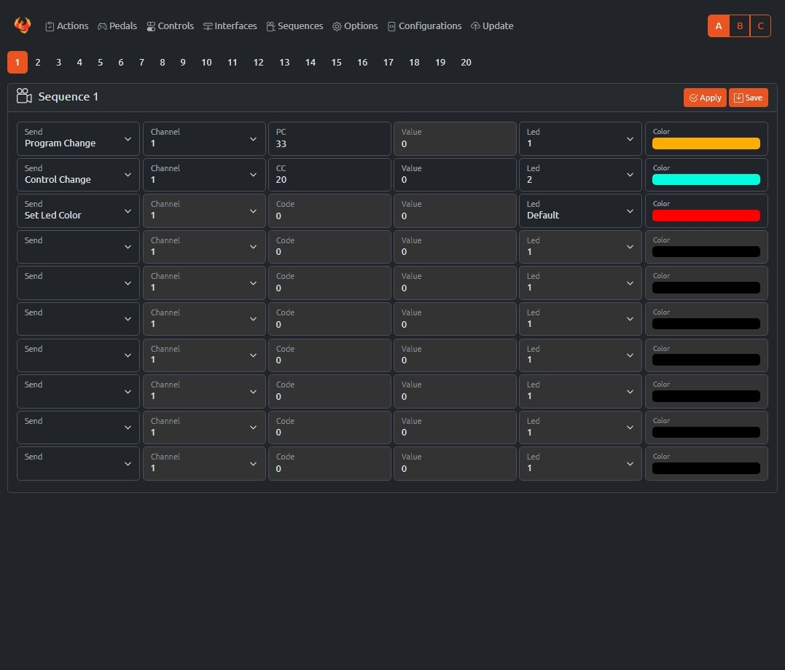

# Sequences

A **Sequence** is a customizable set of actions that can be triggered together with a single press. These actions include standard MIDI messages, transport controls, and system-specific commands like LED color changes. Sequences allow for complex automation, such as switching presets, controlling effects, and providing visual feedback.

Up to 20 sequences can be programmed and saved, each containing multiple actions that execute in order.

#### Available Actions  

- **Program Change** – Sends a MIDI Program Change message to switch presets or patches.  
- **Control Change** – Sends a MIDI Control Change (CC) message to adjust parameters like volume, modulation, or effects.  
- **Control Change Snap** – Sends a CC message but ensures it snaps to a predefined value.  
- **Note On** – Triggers a MIDI Note On message, typically used for playing notes.  
- **Note Off** – Sends a MIDI Note Off message to stop a played note.  
- **Bank Select+** – Increases the current bank number.  
- **Bank Select-** – Decreases the current bank number.  
- **Program Change+** – Increments the current program number.  
- **Program Change-** – Decrements the current program number.  
- **Pitch Bend** – Sends a Pitch Bend message to alter the pitch of a note.  
- **Channel Pressure** – Sends an Aftertouch (Channel Pressure) message.  
- **Start** – Sends a MIDI Start message to begin playback of a sequence or external MIDI device.  
- **Stop** – Sends a MIDI Stop message to halt playback.  
- **Continue** – Sends a MIDI Continue message to resume playback.  
- **Sequence** – Triggers another sequence, allowing for nested automation.  
- **Set Bank** – Changes the active bank.  
- **Set LED Color** – Changes the color of a specific LED for visual feedback.  

Sequences can be edited and saved through the web interface, allowing for flexible real-time control.  