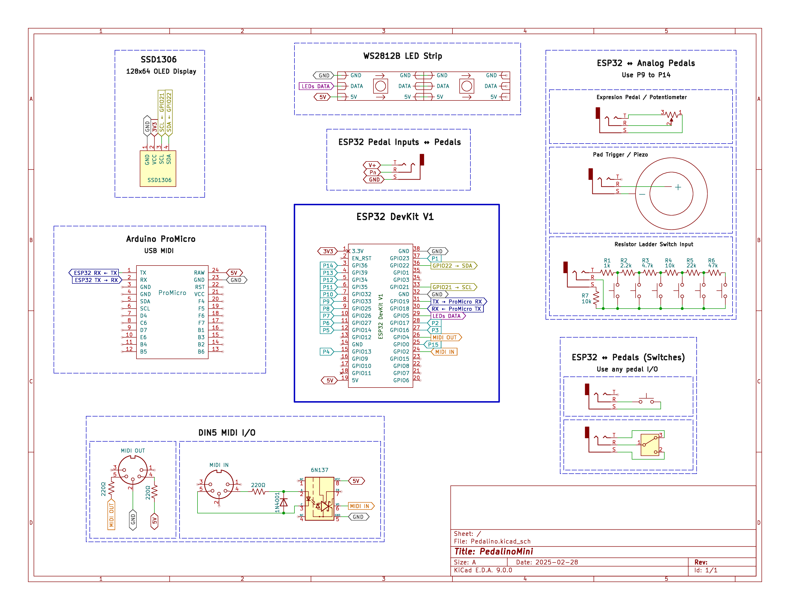

# Schematic

    
    <button id="openModal" class="modal-button" title="View full size">⤢</button>

  &times;
  

    
  

    
<em>Tip: Use mouse wheel to zoom in/out. Double-click to reset view. Click the expand button to open in full screen.</em>

!!! warning "Floating Pins"
    You need to add pullup resistors on `P9` to `P14` (`ADC GPIOs`) otherwise pins will be floating. A floating pin can trigger unexpected MIDI events. As alternative you can disable the not used pedals via web interface.

---

## Switch Ladder 

To create your own ladder you can start simulating the below one:

<iframe src="https://www.falstad.com/circuit/circuitjs.html?ctz=CQAgjCAMB0l3BWKIBsAOESGUwUwLRhgBQATuAOwrgAsNIATAtWHcgw3GY87fQMwIGfZDQpdyg4a3p0MM5GHiRuckQjYKcHeNw30FKGji0gxugM6UWmqowrCTIAC6kArrmJWmN+j-uO4C7unlZSIuEMDorBHl5mNPJsalGBEK5xVvrqbKkxGaGoxiJG2tFOBdwAnL7WIia6APJ1efzCeRAqAO4t0f553TzUrUIBUMQ9kdEp5RMJGHnZA3NL0aVjKgDmdeFgdjRg1DgqAEogNSIXYAwYx2Y4-ND8yMfQCMQAHkFMSCgQTBg-PQTgBJAByAHFPqgzAxnlUqrDqECQABlAAyAFFMQA1THQwhIVjUCgQViIlEAFRBAAUADoWfg4-jcPbUXZ2AbgZTQsBoZ4MFDtMSMFBIAzUQAJhDAEDjAEmE0MFAr+IH4NCQgtk4ClMDFKHl0MECxVdG0RjM2pA0ugKD+Bq+CAQ-xQOBQ-GVzwlVpgbTA9rMGlFEAQ-GG5q91qEDH9BwMRDMdiIWoYBmgfJx0KdJnjCGiSYtKagNv10Jd8njKHE4FYBfoPpoGa+hyJ8bAVTjyYEjcYgmr-zQHdrjDe3f4bb7qrQZJrKLA0AHGaAA&editable=false&hideMenu=true&" width="800" height="400" frameborder="0"></iframe>

- [Circuit Simulation Applet](https://www.falstad.com/circuit/circuitjs.html?ctz=CQAgjCAMB0l3BWKIBsAOESGUwUwLRhgBQATuAJwBMIAzDVQOw33JVVxkhMsvp00cAFkadytfqyEohA5GHiQu02awQocrHO3hd1mminVzhozgGdKvK+A3yQAF1IBXXMUs85nsHZwQnru50knwYPjh+ji5ulipyceH2ATGYdmp2iZHJQUYocrm2EeBRgeRE1mDUJuC6API2iUJhGVDEAO4Ndt6+7dzMhcHNEb0SQyAJPR0TOPoDSh2ziQWZxADmNlRCflW0kLLDAErgYBUntsjCmtC0F1DQCMQAHuCM4EI3jK9g0uPcsgcASQAcgBxJ7cFhEY5IWjfX6bEAAZQAMgBRVEANVR4IgtFkaFetFesgRABUAQAFAA65loGNoXEqDC2nSKCl0z0qFHA2G4KBuYAQN1kPhAgATCGAIDGAJMJwUxud9uRIIIKaCK8hLoLkZeCiSKhNyhMZVb9RZqUCgwDrnuovk1UAaeRB1eKYPQrbLniI-I6EAgaCaXZr-VRreNdiBCOMqmq-uBoGA0Bjwf68lGEGgMLGETALcnnigEVH0Hls-trkJ8+A0BAo1QFNx4aoq1QELXcXBGySSfcq7RaEgo7QKK8y-G0JXiEA)
